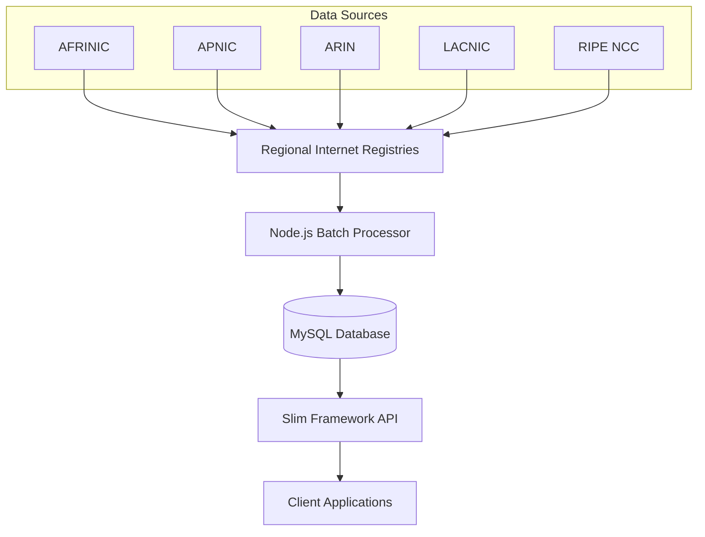

# IP Registry Data Processing System

地域インターネットレジストリ（RIR）からIPアドレス割り当て情報を取得・処理し、高速検索APIを提供するシステムです。

## システム概要

このシステムは、世界5つの地域インターネットレジストリ（AFRINIC, APNIC, ARIN, LACNIC, RIPE NCC）からIPアドレス割り当て情報を自動取得し、効率的な検索システムを構築します。

### 主要コンポーネント

- **nodejs-batch**: Node.js製のデータ処理バッチシステム
- **slim-iplist**: PHP Slim Framework製のフロントエンドAPI
- **MySQL Database**: IPv4/IPv6統合データベース
- **Docker Environment**: コンテナ化された実行環境

## アーキテクチャ



## 特徴

### 🚀 高速検索
- 事前計算された開始IP・終了IPによる範囲検索最適化
- バイナリIPアドレス形式での効率的なインデックス
- IPv4/IPv6統合テーブルでの一元管理

### 🌐 包括的カバレッジ
- 世界5大地域レジストリからの完全なデータ取得
- IPv4とIPv6の両方に完全対応
- リアルタイムデータ更新機能

### 🔧 運用性
- Docker Composeによる簡単デプロイメント
- 環境別設定管理（development/production）
- 詳細なログ出力とエラーハンドリング

### 📊 スケーラビリティ
- 並列処理による高速バッチ処理
- トランザクションテーブルによるゼロダウンタイム更新
- 効率的なデータベーススキーマ設計

## クイックスタート

### 前提条件

- Docker & Docker Compose
- Node.js 22+ (開発時)
- Git

### 1. リポジトリクローン

```bash
git clone <repository-url>
cd ipcounttest
```

### 2. 環境構築

```bash
# Docker環境起動
docker-compose up -d

# データベース初期化
cd nodejs-batch
npm install
node src/index.js -e development -m
```

### 3. データ取得・処理

```bash
# 全レジストリのデータを並列処理
node src/index.js -e development -p

# 特定レジストリのみ処理
node src/index.js -e development -r apnic

# テストモード（制限数での実行）
node src/index.js -e development -t --ipv4-limit 1000 --ipv6-limit 500
```

### 4. API利用

```bash
# IPv4アドレス検索
curl http://localhost/ip/8.8.8.8

# IPv6アドレス検索
curl http://localhost/ip/2001:4860:4860::8888
```

## ディレクトリ構成

```
ipcounttest/
├── docker-compose.yml          # Docker構成
├── mysql.env                   # MySQL環境変数
├── nodejs-batch/              # データ処理バッチ
│   ├── src/
│   │   ├── index.js           # メインエントリーポイント
│   │   ├── config/           # 設定ファイル
│   │   ├── processors/       # データ処理ロジック
│   │   └── utils/           # ユーティリティクラス
│   ├── sql/                 # SQLスクリプト
│   └── package.json        # Node.js依存関係
├── slim-iplist/            # フロントエンドAPI
│   ├── public/             # Webルート
│   ├── src/               # PHPソースコード
│   ├── config/            # データベース設定
│   └── composer.json      # PHP依存関係
└── samplefiles/           # サンプルデータ（開発用）
```

## データベーススキーマ

### 主要テーブル

#### ip_allocations（本テーブル）
- IPv4/IPv6統合IP割り当て情報
- バイナリ形式でのIP範囲格納
- 高速検索用インデックス最適化

#### ip_allocations_trn（トランザクションテーブル）
- データ更新作業用の一時テーブル
- ゼロダウンタイム更新を実現

#### countries（マスターテーブル）
- 国コードと国名のマッピング

#### registries（マスターテーブル）
- 地域レジストリ情報とデータソースURL

### パフォーマンス最適化

- **範囲検索インデックス**: `(ip_version, ip_start_binary, ip_end_binary)`
- **国別検索インデックス**: `(country_code)`
- **レジストリ別インデックス**: `(registry)`

## バッチ処理詳細

### サポートレジストリ

| レジストリ | 地域 | データ形式 |
|-----------|------|----------|
| AFRINIC | アフリカ | 標準 |
| APNIC | アジア太平洋 | 標準 |
| ARIN | 北米 | 拡張 |
| LACNIC | ラテンアメリカ・カリブ | 標準 |
| RIPE NCC | ヨーロッパ・中東・中央アジア | 標準 |

### 処理フロー

1. **データダウンロード**: 各レジストリのデータソースから最新データを取得
2. **データ解析**: IPv4/IPv6アドレス範囲をCIDRブロックに分割
3. **範囲計算**: 開始IP・終了IPを事前計算
4. **データベース格納**: トランザクションテーブル経由で安全に更新
5. **本テーブル移行**: ゼロダウンタイムでの本テーブル反映

## API仕様

### エンドポイント

- `GET /ip/{ip_address}`: IPアドレス情報検索

### レスポンス形式

```json
{
  "in_ip": "検索IP",
  "data_flg": "OK/NG",
  "hostname": "逆引きホスト名",
  "ip_version": "IPv4/IPv6",
  "country_code": "国コード",
  "country_name": "国名",
  "registry_name": "レジストリ名",
  "netblock_cidr": "CIDR表記",
  "allocation_date": "割り当て日",
  "status": "ステータス"
}
```

## 運用ガイド

### 定期データ更新

```bash
# cron設定例（毎日深夜2時に実行）
0 2 * * * cd /path/to/nodejs-batch && node src/index.js -e production -p
```

### ログ監視

```bash
# バッチ処理ログ
tail -f nodejs-batch/logs/app.log

# API アクセスログ
tail -f slim-iplist/logs/access.log
```

## 開発・コントリビューション

### 開発環境セットアップ

```bash
# 開発用コンテナ起動
docker-compose -f docker-compose.dev.yml up -d

# テストデータ作成
node src/index.js -e development -t
```

## ライセンス

MIT License

